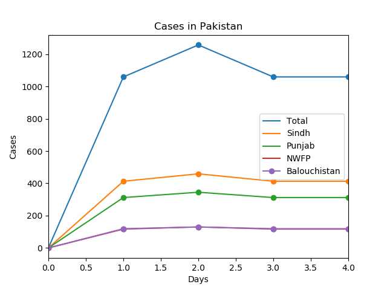

# CoronaVirus-Analyzer
Scraps a website for the data, then plots graphs for each province's data. Data is for Pakistan and is taken from Geo.tv Website. You need firefox geckodriver to run this.

## Screenshot

<table>
  <tbody>
    <tr>
      <!-- Video 1 -->
      <td align="center">
          
           
      </td>
    </tr>
  </tbody>
</table>
